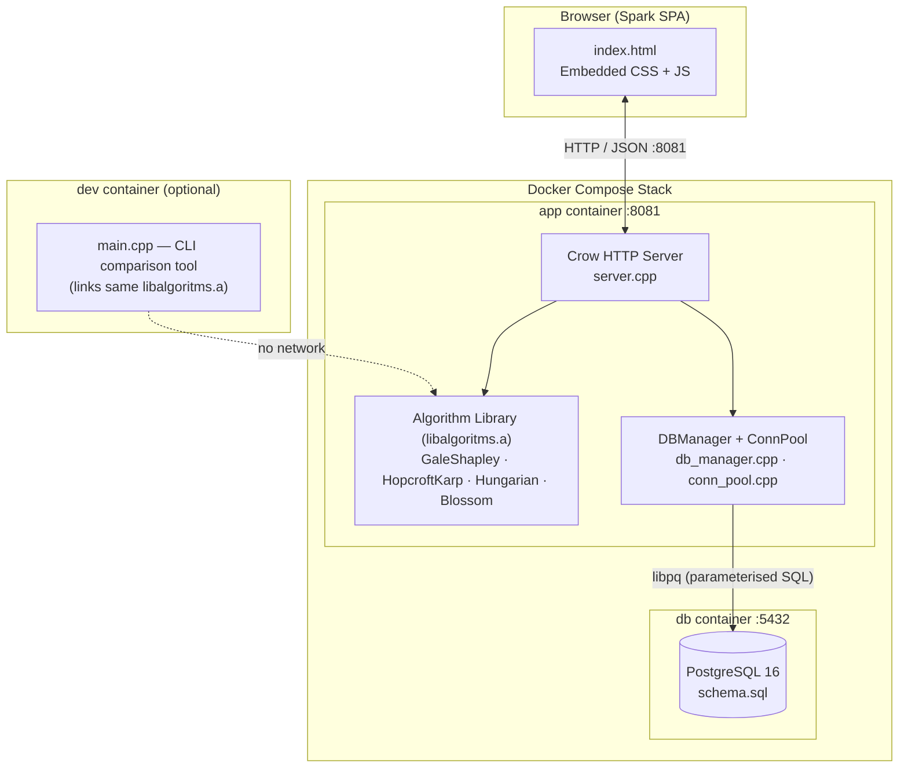
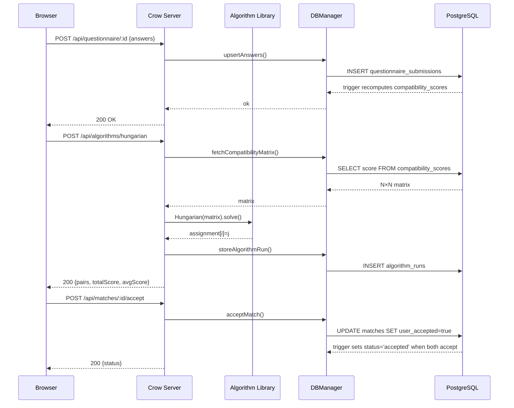
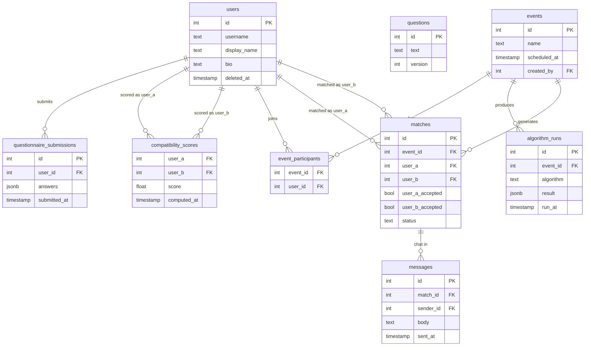
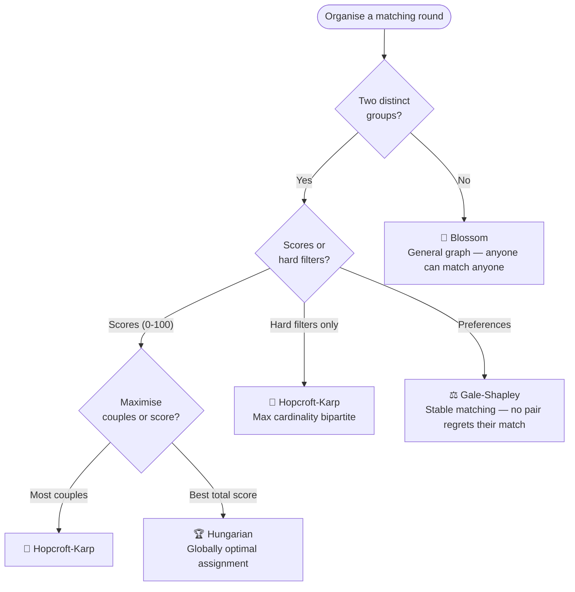

# Spark — Blind Dating Platform

A C++ blind dating platform built around four classical matching algorithms. Users fill out a compatibility questionnaire; the server scores all pairs and feeds the matrix into whichever algorithm the organiser selects. The UI ("Spark") never reveals identity until both people accept the match.

---

## System Architecture



### Request Flow



### Database Schema



---

## Quick Start

**Prerequisites:** Docker with Compose plugin.

```bash
# 1. Configure environment
cp .env.example .env          # set DB_NAME, DB_USER, DB_PASSWORD

# 2. Start the full stack (server + PostgreSQL)
make docker-start             # detached; server at http://localhost:8081

# 3. View logs
make docker-logs

# 4. Stop
make docker-stop
```

To run the CLI comparison tool or tests:

```bash
make run          # build + run side-by-side algorithm comparison
make run_tests    # build + run all unit tests
make lint         # clang-tidy static analysis
```

Run a single test binary:

```bash
docker compose run --rm dev ./build/test_gale_shapley
```

---

## Project Structure

```
DatingApp/
├── main.cpp                    — CLI: runs all 4 algorithms on a 6×6 dataset
├── CMakeLists.txt              — Root CMake; fetches Crow + GoogleTest
├── Makefile                    — Thin Docker Compose wrapper
├── Dockerfile                  — 3-stage image (dev · builder · runtime)
├── docker-compose.yml          — Services: app · dev · db
│
├── src/                        — Algorithm static library (libalgoritms.a)
│   ├── gale_shapley.{h,cpp}    — Stable Matching          O(n²)
│   ├── hopcroft_karp.{h,cpp}   — Max Bipartite Matching   O(E√V)
│   ├── hungarian.{h,cpp}       — Optimal Assignment       O(n³)
│   ├── blossom.{h,cpp}         — General Graph Matching   O(V³)
│   └── tests/                  — Unit tests (GoogleTest)
│
├── server/
│   ├── server.cpp              — Crow REST API (~656 lines, port 8081)
│   ├── db_manager.{h,cpp}      — PostgreSQL query layer
│   ├── conn_pool.{h,cpp}       — Thread-safe connection pool
│   ├── thread_pool.h           — Worker thread management
│   ├── db_types.h              — Shared DB data structures
│   ├── static/index.html       — Single-page app (Spark UI)
│   ├── BRANDING.md             — Spark design system reference
│   └── tests/                  — Integration & unit tests
│
├── db/
│   └── schema.sql              — PostgreSQL 16 schema (auto-applied on start)
│
└── docs/
    └── architecture.md         — Extended architecture notes
```

---

## API Reference

### Static / UI

| Method | Path | Description |
|--------|------|-------------|
| `GET` | `/` | Serve Spark SPA |
| `GET` | `/static/<file>` | Static assets |

### User Management

| Method | Path | Description |
|--------|------|-------------|
| `POST` | `/api/users/register` | Register a new participant |
| `POST` | `/api/users/login` | Authenticate; returns session token |
| `GET` | `/api/users` | List all participants *(admin)* |
| `GET` | `/api/users/:id` | Public profile |
| `PUT` | `/api/users/:id` | Update name / bio / prefs |
| `DELETE` | `/api/users/:id` | Remove account |

### Questionnaire & Compatibility

| Method | Path | Description |
|--------|------|-------------|
| `POST` | `/api/questionnaire/:id` | Submit answers; triggers score recomputation |
| `GET` | `/api/compatibility` | Full score matrix *(admin / debug)* |

### Matching Algorithms

| Method | Path | Description |
|--------|------|-------------|
| `POST` | `/api/algorithms/gale-shapley` | Stable pairs (proposer-optimal) |
| `POST` | `/api/algorithms/hopcroft-karp` | Maximum number of couples |
| `POST` | `/api/algorithms/hungarian` | Globally optimal total score |
| `POST` | `/api/algorithms/blossom` | General-graph maximum matching |
| `GET` | `/api/algorithms/compare` | Run all four; side-by-side JSON |

### Matches

| Method | Path | Description |
|--------|------|-------------|
| `GET` | `/api/matches` | All matches for the session user |
| `GET` | `/api/matches/:id` | Single match details |
| `POST` | `/api/matches/:id/accept` | Accept a match |
| `POST` | `/api/matches/:id/decline` | Decline; removes pairing |

### Events (Speed-Dating Rounds)

| Method | Path | Description |
|--------|------|-------------|
| `GET` | `/api/events` | List upcoming events |
| `POST` | `/api/events` | Create event *(admin)* |
| `GET` | `/api/events/:id` | Event details + participant list |
| `POST` | `/api/events/:id/register` | Join an event |
| `GET` | `/api/events/:id/results` | Algorithm results for event |

### Messages

| Method | Path | Description |
|--------|------|-------------|
| `GET` | `/api/messages/:matchId` | Message history (cursor-based) |
| `POST` | `/api/messages/:matchId` | Send a message |

---

## Algorithms

All four algorithms share a uniform output interface: `std::vector<int>` where `result[i] = j` (matched) or `-1` (unmatched). This makes the `matchesToJson()` helper in `server.cpp` and the side-by-side comparison in `main.cpp` straightforward.

| Algorithm | Input | Guarantee | Time | Space |
|-----------|-------|-----------|------|-------|
| **Gale-Shapley** | Two ranked preference lists | Stable, proposer-optimal | O(n²) | O(n²) |
| **Hopcroft-Karp** | Bipartite graph (edges where score ≥ threshold) | Maximum cardinality | O(E√V) | O(V+E) |
| **Hungarian** | n×n score matrix | Globally optimal total score | O(n³) | O(n²) |
| **Blossom** | General undirected graph | Maximum cardinality, handles odd cycles | O(V³) | O(V+E) |

### When to Use Which



### Key Implementation Notes

- **GaleShapley** pre-computes rank lookup tables (`rankA_[i][j]`, `rankB_[j][i]`) so preference comparisons during proposals are O(1) rather than O(n).
- **Blossom on bipartite data**: men are encoded as vertices `0..N-1`, women as `N..2N-1`; `blossom.getMatching()[m] - N` gives the woman index. See `runBlossom()` in `main.cpp` and `server.cpp`.
- **Hungarian** negates scores internally (minimises cost = maximises score). The `maxScore_` field is the true maximum.
- All algorithms are stateless at construction and safe to re-run; each `.run()` / `.solve()` / `.maxMatching()` call re-initialises internal state.

---

## Build System

CMake is the build system; the `Makefile` delegates everything to `docker compose run --rm dev`. Build artifacts go into a named Docker volume (`dev_build`) — not into `./build/` on the host.

```
Root CMakeLists.txt
├── main executable         (links algorithms)
├── src/CMakeLists.txt
│   ├── algorithms          (static lib)
│   └── 4× test executables
└── server/CMakeLists.txt
    ├── server executable   (links algorithms + Crow + libpq)
    └── 4× test executables
```

Crow v1.2.1 and GoogleTest v1.14.0 are fetched at configure time via `FetchContent` — no vendored dependencies in the repo.

---

## Database

PostgreSQL 16 (`db` service). Schema is applied automatically from `db/schema.sql` on first container start.

Key design decisions:

- **Row Level Security** is enabled on sensitive tables. The app sets `app.current_user_id` and `app.current_role` session variables to drive RLS policies.
- **PII columns** (`real_name`, `email`, `password_hash`) are marked RESTRICTED.
- The `sync_match_status` trigger automatically sets `status='accepted'` when both `user_a_accepted` and `user_b_accepted` are `TRUE` — no application logic needed.
- The questionnaire submission trigger recomputes `compatibility_scores` asynchronously so algorithms always read a fresh matrix.
- `algorithm_runs` caches JSONB output per event to avoid re-running expensive algorithms on repeated page loads.

---

## Algorithm Comparison (Property Table)

| Property | Gale-Shapley | Hopcroft-Karp | Hungarian | Blossom |
|----------|-------------|--------------|-----------|---------|
| Input | Ranked prefs | Filter graph | Score matrix | General graph |
| Optimality | Proposer-optimal | Max cardinality | Max total score | Max cardinality |
| Handles scores | No | No | Yes | No (weighted variant exists) |
| Requires two sides | Yes | Yes | Yes | **No** |
| Guarantees stability | Yes | No | No | No |
| Handles odd cycles | N/A | N/A | N/A | Yes |

---

## References

- Gale, D. & Shapley, L. S. (1962). *College Admissions and the Stability of Marriage.* The American Mathematical Monthly.
- Hopcroft, J. E. & Karp, R. M. (1973). *An n^(5/2) Algorithm for Maximum Matchings in Bipartite Graphs.* SIAM Journal on Computing.
- Kuhn, H. W. (1955). *The Hungarian Method for the Assignment Problem.* Naval Research Logistics.
- Edmonds, J. (1965). *Paths, Trees, and Flowers.* Canadian Journal of Mathematics.
